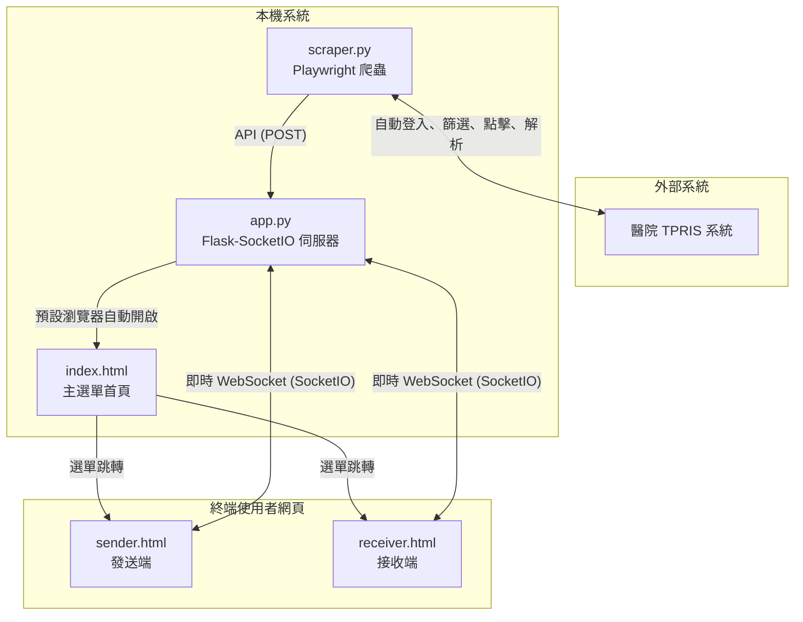

# 🏥 Portable 醫療派遣與排程通知系統 (Portable X-Ray Dispatch System)

這是一套專為醫療環境設計的自動化 Portable (移動式/床邊) 照影派遣與排程通知系統。系統透過 **Playwright 網頁爬蟲技術**，自動登入並讀取醫院的 TPRIS 系統，即時抓取最新「櫃台報到」且屬於 Portable 分類的病患名單，並利用 **Flask-SocketIO 即時通訊技術**，在「發送端 (Sender)」與「接收端 (Receiver)」之間進行零延遲的雙向派遣與排程協調。

---

## 🌟 核心特色

* **🤖 自動化 TPRIS 爬蟲同步**
  * 使用 Playwright 驅動瀏覽器自動登入 TPRIS 系統。
  * 強制篩選「Portable」選項，即時過濾非必要的急診 CR 項目。
  * 自動點擊病患卡片，深度抓取**床號（病房）**與**檢查部位（檢查項目）**。
  * 內建高效率的快取記憶機制（Cache），避免重複點擊相同病患卡片，大幅提升讀取效能。

* **⚡ 雙向即時通訊 (Websocket)**
  * **發送端 (Sender)**：即時呈現在院 Portable 報到病患清單，點選病患即可一鍵發出派遣請求。
  * **接收端 (Receiver)**：即時以醒目的動畫與音效提示新請求，並提供確認（例如：10分鐘後到、接受）反饋。
  * 發送與確認過程完全自動化更新，不需手動重新整理網頁。

* **📦 免安裝一鍵運行 (Portable Edition)**
  * 提供整合 PyInstaller 的打包方案，將 Python 執行環境、Flask 伺服器、網頁範本、靜態資源以及 Playwright Chromium 瀏覽器驅動完整封裝。
  * 產出獨立執行檔，雙擊即可在醫院未安裝 Python 的內網電腦上直接運行。

---

## 🏗️ 系統架構



---

## 📁 專案檔案結構

* `app.py`：Flask & SocketIO 後端主程式，管理 WebSocket 狀態、處理爬蟲同步的 API，並在啟動時自動於背景開啟爬蟲與主選單網頁。
* `scraper.py`：網頁爬蟲核心程式，負責自動操作 TPRIS 網頁並解析病患名單，每 10 秒即時同步一次。
* `static/`：存放靜態樣式檔與資源，包含 UI 的 Vanilla CSS 及視覺設計。
* `templates/`：前端網頁範本（包含 `sender.html` 及 `receiver.html`）。
* `requirements.txt`：列出本專案所需的 Python 依賴套件。
* `打包程式.py`：PyInstaller 的打包指令稿，設定如何打包靜態範本與 Playwright 核心。
* `打包成執行檔.bat`：一鍵執行打包指令，產出 Portable 執行資料夾。
* `啟動系統.bat`：為終端使用者設計的一鍵啟動批次檔。

---

## ⚙️ 開發與測試環境架設

若您要在本機進行開發或測試，請依循以下步驟：

### 1. 安裝 Python 套件
請確保您已安裝 Python 3.10+，並在專案根目錄下執行：

```bash
pip install -r requirements.txt
```

### 2. 安裝 Playwright 瀏覽器核心
Playwright 首次執行前需要下載專用的 Chromium 瀏覽器核心，請執行：

```bash
playwright install chromium
```

### 3. 本地執行
執行主程式，系統會自動在背景啟動爬蟲，並在 4 秒後自動以預設瀏覽器開啟主控制頁面（`http://127.0.0.1:5000/`）：

```bash
python app.py
```

---

## 📦 打包發佈 (Production Build)

如需部署至醫院內網的電腦，建議打包成獨立綠色執行檔：

1. 雙擊執行 `打包成執行檔.bat`。
2. 編譯完成後，會在專案目錄下產生 `dist/` 資料夾。
3. 將整個 `dist/Portable派遣系統` 資料夾複製到目標電腦，點擊裡面的 `啟動系統.bat` 即可直接運行。

---

## 🔒 授權條款與免責聲明

此系統僅供學術交流與醫院內部流程改善使用。爬蟲程式會儲存本地快取以提供操作流暢度，請確保您的登入憑證與病患隱私安全，並遵守醫療機構的資安防護規範。
