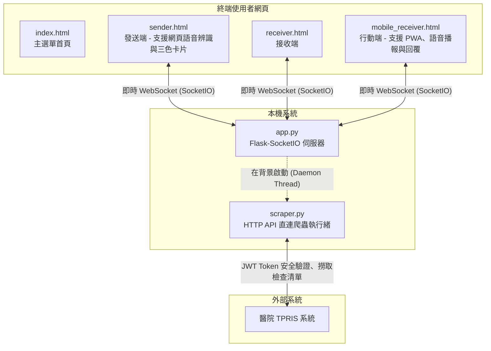

# 🏥 Portable 醫療派遣與排程通知系統 (Portable X-Ray Dispatch System)

這是一套專為醫療放射科與病房環境設計的**實時智慧 Portable (移動式/床邊) 照影派遣與排程通知系統**。系統使用高效能直連 HTTP API 方式，安全登入並讀取醫院的 TPRIS 系統，實時抓取最新報到且屬於 Portable 分類的今日病患名單，並利用 **Flask-SocketIO 即時通訊技術**，在「發送端 (Sender)」、「接收端 (Receiver)」與「行動端 (Mobile)」之間進行零延遲的雙向派遣、排程協調與語音控制。

---

## 🌟 核心特色 (Key Features)

* **⚡ 實時醫院 API 直連同步 (完全連線模式)**
  * **捨棄繁重的網頁爬蟲**：改用高效能 JWT 安全驗證連線直接對接 TPRIS 系統 API，數據獲取速度提升 10 倍以上，且不需要安裝或背景執行任何 Chromium 瀏覽器核心。
  * **智慧聯集過濾篩選**：
    * 篩選今日已開單符合醫令名稱為 `Chest(AP)Portable` 的病患卡片。
    * 篩選今日已開單且病床號為重症病房的病患卡片，關鍵字前綴支援擴充：`MICU`、`SICU`、`CCU`、`NCU`、`RCC`、`CIU` 、`SIU`、`RCW` 等。
    * **精準過濾儀器類別**：自動去除儀器類別為 `CT`、`MR` 或 `MRI` 的病患，只專注於 Portable 床邊照影需求。

* **🎨 智慧三色卡片狀態與自動排程排序**
  * 卡片依據病人目前情況以**質感莫蘭迪三色**進行標記：
    * 🔘 **灰色** ➡️ **未報到** (智慧優先置於清單最上方，方便人員隨時點選/語音辦理報到)
    * 🔵 **藍色** ➡️ **已報到** (自動對齊醫院端「櫃台報到」狀態或本系統手動/語音報到，整齊排序在「已分派」卡片的上方)
    * 🟤 **咖啡色** ➡️ **已分派** (智慧置於清單最下方，避免視覺干擾，若醫院端 Status 變更為已分派也將自動對齊變色)
  * **🔍 快速搜尋與即時篩選**：發送端面板整合極致響應的搜尋框，輸入**病歷號或姓名**即可以 0 延遲的極速動畫自動篩選呈現卡片。當 Socket 數據更新時，篩選文字與狀態會**自動完美維持**，提供極佳的操作流暢度！
  * **自由拉伸介面**：主面板解鎖為可手動拉伸（支援水平與垂直自由拖拽縮放），提供完美自由度！

* **🎙️ 雙向語音辨識與自動報到控制系統 (Hands-free Voice Control)**
  * **電話來電監聽**：搭配 `AndroidCallMonitor` 行動端，自動分析通話內容文字。
  * **網頁端麥克風控制**：發送端網頁 ([sender.html](file:///c:/Users/user/新增資料夾/QCC/templates/sender.html)) 內建精美雙色動畫語音控制按鈕與即時語意解析。
  * **支援語意命令**：
    * 🗣️ 說出 `「林小華報到」` ➡️ 卡片立刻在 100ms 內在螢幕上變成**藍色已報到**狀態。
    * 🗣️ 說出 `「林小華取消報到」` ➡️ 卡片回復為**灰色未報到**並自動置頂。
    * 🗣️ 說出 `「林小華發送」` 或 `「派遣林小華」` ➡️ 系統會自動為您送出該病患的派遣任務，卡片隨之變為**咖啡色已分派**並排序至最下方。

* **🔒 多組操作人員設定與 Glassmorphism 安全登入**
  * **動態操作員切換**：支援在 `.env` 中配置多組操作員 `TPRIS_ACCOUNT_X` 與 `TPRIS_PASSWORD_X`。
  * **智能身分自動匹配**：登入時提供選填帳號，留空則自動依密碼匹配身分。登入後，背景直連爬蟲執行緒會**實時重置 Token 並以該操作員的帳密向醫院端安全登入與驗證**，完美保證醫院系統上正確登記有不同操作人員的存取軌跡！
  - 登入介面具備精美的高端磨砂玻璃（Glassmorphism）視覺與微動畫，保障病患資料與資安合規。
  - **操作員全端呈現**：在發送端、接收端與行動端的頂部橫幅中，新增 `👤 操作員: <帳號>` 藍色氣泡，提供極佳的狀態清晰度。

* **🌐 動態區域網路 (LAN) IP 與 Port 自動偵測**
  * 後端自動抓取本機在醫院內網的實體 IP 與埠口，並在各控制端上以質感的莫蘭迪綠橫幅顯眼展示，利於其他科室快速輸入網址連入。

* **📱 行動端 PWA 支援與語意語音播報 (TTS)**
  * 行動端（`/mobile`）支援將網頁「安裝」至 Android/iOS 設備桌面上，並在收到新單時自動發出真實語音播報，且支援語音回報「確認/十分鐘後到」。

* **🚀 精簡單一視窗啟動架構**
  * 優化 `run.py` 啟動器，每次雙擊 `啟動系統.bat` 只會精準開啟一個瀏覽器視窗與單一背景爬蟲，避免耗損效能與重複 Session 登入。

---

## 🏗️ 系統架構



---

## 📁 專案檔案結構

* `app.py`：Flask & SocketIO 後端主程式，管理 WebSocket 狀態、處理 API，並在啟動時自動於背景開啟**單個**背景爬蟲執行緒與開啟主選單網頁。
* `scraper.py`：直連 API 核心程式，負責對醫院 API 進行資料同步與篩選（單日上限放寬至 3000 筆以保證清晨開單不漏單），每 10 秒即時同步一次。
* `run.py`：系統同步啟動器，負責以安全且單一視窗的方式調用 `app.py`。
* `static/`：存放靜態樣式檔與資源，包含 UI 的 Vanilla CSS 及視覺設計。
* `templates/`：前端網頁範本（包含 `sender.html`、`receiver.html`、`mobile_receiver.html` 與 `login.html`）。
* `.env`：存放安全驗證之 `TPRIS_ACCOUNT` 與 `TPRIS_PASSWORD`。
* `requirements.txt`：列出本專案所需的 Python 依賴套件。
* `打包程式.py`：PyInstaller 的打包指令稿，設定如何打包靜態範本。
* `打包成執行檔.bat`：一鍵執行打包指令，產出 Portable 執行資料夾。
* `啟動系統.bat`：為終端使用者設計的一鍵啟動批次檔。

---

## ⚙️ 開發與測試環境架設

若您要在本機進行開發或測試，請依循以下步驟：

### 1. 安裝 Python 套件
請確保您已安裝 Python 3.10+，並在專案根目錄下執行：

```bash
pip install -r requirements.txt
```

### 2. 配置環境變數
請在根目錄建立或編輯 `.env` 檔案，填入醫院系統的登入資訊：

```env
TPRIS_ACCOUNT=您的帳號
TPRIS_PASSWORD=您的密碼
```

### 3. 本地執行
雙擊執行 `啟動系統.bat` 或在終端機輸入：

```bash
python run.py
```
系統會自動在背景啟動單一 API 同步執行緒，並自動以預設瀏覽器開啟主控制頁面（`http://127.0.0.1:5000/`）。

---

## 📦 打包發佈 (Production Build)

如需部署至醫院內網的電腦，建議打包成獨立綠色執行檔：

1. 雙擊執行 `打包成執行檔.bat`。
2. 編譯完成後，會在專案目錄下產生 `dist/` 資料夾。
3. 將整個 `dist/Portable派遣系統` 資料夾複製到目標電腦，雙擊裡面的 `啟動系統.bat` 即可直接運行。

---

## 🔒 授權條款與免責聲明

此系統僅供學術交流與醫院內部流程改善使用。API 直連連線模式會遵守安全連線規範，請確保您的登入憑證與病患隱私安全，並遵守醫療機構的資安防護規範。
